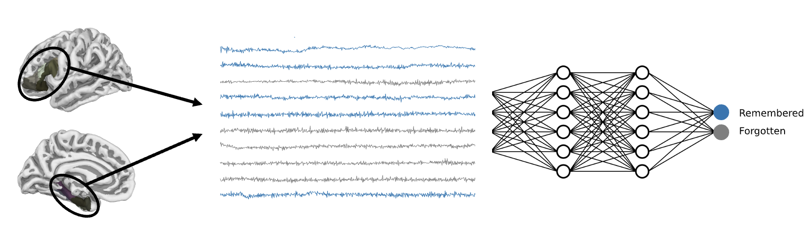

# Predict-encoding



Preprocessing and source-localization of the high-density electroencephalogram (EEG) data from the [Penn Electrophysiology of Encoding and Retrieval Study](https://openneuro.org/datasets/ds004395/versions/2.0.0), a large-scale open dataset (7,000+ 90 minute sessions across 300+ subjects) focused on verbal memory encoding.

## Overview 

### Background
Specific patterns of electrical acivity are observed within areas of the left inferior-frontal and left medial-temporal cortices in the few seconds after the visual presentation of words. These electrical currents promote verbal memory encoding: (1) their time-series can be used to predict whether words will be subsequently recalled, and (2) their experimental manipulation (via closed-loop stimulation) can be used to enhance the probability of subsequent word recall.

### Problem
Verbal memory (the ability to recall previously encountered words) decreases considerably in older adults (i.e., aged 60+). It is unclear how degeneration of the neural mechanisms which underly verbal memory encoding contribute to these deficits.

### Solution
To address this problem, we:
1. Identify features of the electrical currents generated in left inferior-frontal and medial-temporal cortices that are predictive of verbal memory encoding (i.e., discriminate subsequently remembered from forgotten words) using both a data-driven approach (focused on massive feature extraction) and theory-driven approach (focused on dynamic shifts in the periodic and aperiodic components of the power spectral density).
2. Test whether these features reliably differ in older adults (aged 60+).


## Structure
```
├── data 
│   ├── dataframes             <- Dataframes (HDF-5 files) containing single-trial ROI time-series and trial info.
│   ├── external               <- Third-party data required for processing.
│   ├── interim                <- Intermediate data created during processing.
│   ├── processed              <- Cleaned *-raw.fif and *-epo.fif data for each EEG session (MNE-python Raw and Epochs objects).
│   └── raw                    <- Raw BIDS-formatted data from OpenNeuro. 
│
├── results                    <- Preprocessing reports.
│
├── slurm                      <- Output of jobs submitted to the SLURM scheduler.
│   ├── output                 <- Sucessful jobs.
│   └── error                  <- Unsucessful jobs.
│
├── src                        <- Source code.
│   ├── preprocessing          <- Module with functions for preprocessing data.
│   ├──├── __init__.py         
│   ├──├── config.py           <- Dictionaries with preprocessing parameters.
│   ├──├── preprocess.py       <- High-level preprocessing functions.
│   ├──└── utils.py            <- Low-level functions.
│   │
│   ├── 00_download_data.sh    <- Download raw BIDS data from OpenNeuro.
│   ├── 01_run_pipeline.py     <- Run the pipeline for each EEG session.
│   └── pipeline.py            <- Preprocessing pipeline.
│
├── .env                       <- Environment variables.
├── .gitignore                 <- Files to be ignored by Git.
├── README.md                  <- Project overview.
└── requirements.txt           <- Dependencies ('pip install -r requirements.txt').
```

## Pipeline

### Set-up.

1. Define environment variables by modifying the `.env` file:
	```shell
	# Project directory.
	project_dir=/path

	# Account used to submit SLURM jobs to the scheduler.
	account=rrg-user
	```

2. Create a virtual environment with the necessary dependencies:
	```shell
	pip install virtualenv
	virtualenv venv
	source venv/bin/activate
	pip install -r requirements.txt
	```

3. Run the shell script `00_download_data.sh`, which downloads the raw BIDS-formatted data from OpenNeurom as well as miscellaenous external data required for the pipeline.
	```shell
	bash src/00_download_data.sh
	```

### Preprocessing

1. The full preprocessing pipeline is implemented through the script `src/01_run_pipeline.py`, which can be run through the terminal:
	```shell
	# Create and run job scripts.
	python src/01_run_pipeline.py --create --run
	```
	**Arguments** \
	`--create`: Writes SBATCH scripts for each EEG session to `/jobs` (note: ~2500 jobs created for each preprocessing stage). \
	`--run`: Submit N jobs (specified in **job_params**) to the scheduler. SLURM has job limits (i.e., 1000), so this needs to be done in chunks. \
	`--report`: Create `results/report.csv` with preprocessing information for each session (number of trials rejected, etc.).
	
	Each script applies a distinct processing stage (named: 'raw', 'epochs', and 'dataframe') to a single EEG session. SBATCH scripts are written to `/jobs`,and are formatted as: `f'sub-{subject}_ses-{session}_{stage}'`. The output of these jobs is written to `/slurm/output/` if sucessful, and `/slurm/error/` if unsucessful. The pipeline is run in three seprate stages to help conserve computational resources, as each stage has different RAM requirements.
	
	The amount of memory and time requested for each job is specified in the dictionary `job_params`, found in the config file of the preprocessing module: **`src/preprocessing/config.py`**
	```python
	job_params = {
		'stage':'raw',
		'hours':00,
		'minutes':15,
		'mem_per_cpu':'16G',
		'n_jobs':500
	}
	```
	**Parameters** \
	`stage (str):` preprocessing stage to run (one of: 'raw', 'epochs', 'dataframe'). \
	`hours (int):` number of hours to request for job. \
	`minutes (int):` number of minutes to request for job. \
	`mem_per_cpu (str):` amount of RAM to request for job. \
	`n_jobs (int):` number of jobs to submit to the scheduler at once.

2. The parameters for the preprocessing pipeline are specifed in the python dictionary **params**, found in the config file of the preprocessing module: **`src/preprocessing/config.py`**:

	```python
	params = {
		'overwrite':False,
		'h_freq_filter':90,
		'l_freq_filter':.1,
		'notch_filter':60,
		'epoch_tmin':-.5,
		'epoch_tmax':3,
		'baseline':(-.5,0),
		'downsample':250
	}
	```
	**Parameters** \
	`overwrite (bool):` whether previous data should be overwritten. \
	`h_freq_filter (int):` high-frequency filter cut-off (Hz). \
	`l_freq_filter (int):` low-frequency filter cut-off (Hz). \
	`notch_filter (int):` frequency of line-noise (Hz). \
	`epoch_tmin (float):` pre-stimulus time for epoching (seconds). \
	`epoch_tmax (float):` post-stimulus time for epoching (seconds). \
	`baseline (float, float):` minimum and maximum time for baseline correction (seconds). \
	`downsample (int):` rate for resampling (Hz).

### How it works

1. The job scripts created through `src/01_run_pipeline.py` run the pipeline `src/pipeline.py` with the appropriate arguments specified.

2. The `preprocess.py` file found within the preprocessing module includes a specific function for each preprocessing stage:

	`preprocess_raw(subject, session)` \
	This cleans the raw EEG and returns an instance of a MNE-python [raw](https://mne.tools/stable/generated/mne.io.Raw.html) object.

	`preprocess_epochs(subject, session)` \
	This epochs the raw data and returns an instance of a MNE-python [epochs](https://mne.tools/stable/generated/mne.Epochs.html) object.

	`preprocess_dataframe(subject, session)` \
	This extracts the single trial source-localized time-series for each ROI in the left 'inferior_frontal' and left 'medial_temporal' cortices of the [HCP_MMP1.0](https://www.nature.com/articles/nature18933) atlas. It then writes the ROI time-series (along with single-trial information) and saves it into a custom file (Hierarchical Data Format, Version 5) formatted as `f'{subject}.h5'`.

3. The `utils.py` file within the preprocessing module contains a set of useful low-level functions. 
